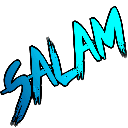

# AlSalam
Al‑Salam ajoute à ton Avatar de vraies salutations arabes

Al Salam symbolise la paix et la tranquillité, offrant un environnement accueillant fondé sur le respect, la confiance et l’harmonie.

This plugin is an add-on for the [A.V.A.T.A.R](https://avatar-home-automation.github.io/docs) framework.

🎯 Usage
Commandes :

salam aleykoum

# Multi-room
The AlSalam plugin is fully multi-room.

# Multi-language
The AlSalam plugin relies solely on the system's available languages.

 <table style="border: none;">
  <tr>
    <td style="border: none;"></td>
    <td style="border: none;">
      <h1 style="margin: 0;color: brown;">AlSalam</h1>
      <h3 style="margin: 0;">Tell salam</h3>
    </td>
  </tr>
</table>
